<h1 align="center">👋 Hi, I’m Gaurav</h1>
<h3 align="center">Full-Stack Developer & System Tinkerer</h3>

  <b>🦉 Night owl by nature, developer by trade.</b>  
  I thrive in the quiet hours, turning fresh ideas into functional, high-performance reality and constantly exploring the bleeding edge of the tech landscape.

---

### 👨‍💻 About Me

- 💡 **Exploring & Building:** I am deeply passionate about taking new concepts from the drawing board to production. Whether it's architecting a new application or experimenting with the latest tooling, I love the process of discovery and continuous learning.
- ❄️ **Nix & System Architecture:** I am a massive advocate for declarative, reproducible systems. You'll frequently find me deep in the weeds of **Nix/NixOS**, managing complex cross-platform configurations via Nix flakes, and automating my environments with Home Manager.
- ⌨️ **The Editor:** My home base is the terminal. I use a heavily customized, modular Lua-based **Neovim** setup, deeply integrated with LSPs and Treesitter, to keep my workflow blazingly fast and entirely keyboard-driven.
- 🔭 **Currently Engineering:**
  - **Expent:** A smart, high-performance expense tracker built with Rust (Axum), Next.js, and OCR transaction processing.
- ⚡ **Stack & Infrastructure:** I love building modern, serverless infrastructure utilizing **AWS** (Lambda, EventBridge) and high-performance package managers like **pnpm**, **uv**, and **Cargo**. I manage my monorepos efficiently using **Turborepo**.
- 🛠️ **Virtualization & DevOps:** I utilize **Proxmox** for local virtualization, managing LXC containers, and optimizing storage and hardware passthrough for self-hosted services.

### 📊 GitHub Stats

  
  

### 🛠️ Tech Stack & Tools

  <!-- Languages & Frameworks -->
  
    
  <!-- DevOps, Infra & Workflow -->
  
    
  <!-- Media & Design -->
  

   
  

